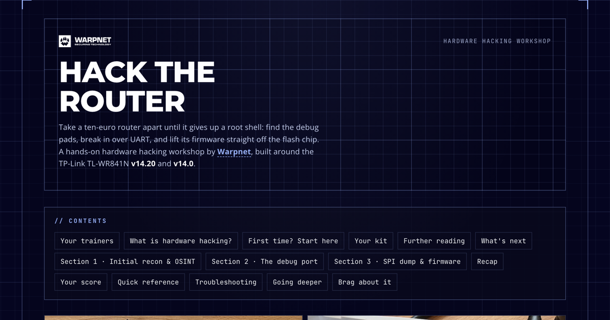
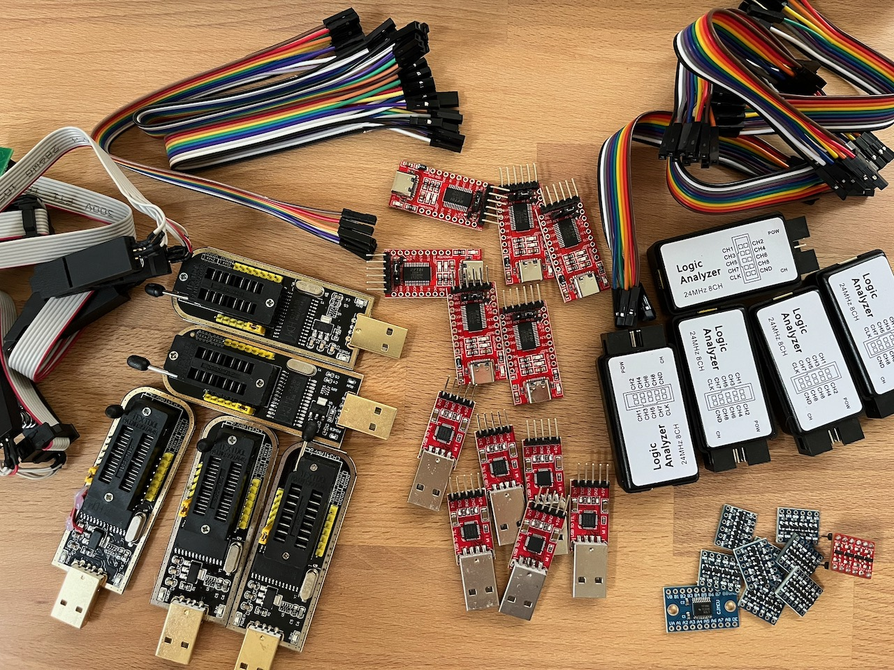

# Hack the Router

[](https://warpnet.github.io/hack-the-router/)

A hands-on **hardware hacking** workshop built around the TP-Link TL-WR841N (**v14.0** and **v14.20**).
Take a ten-euro router apart until it gives up a root shell: OSINT and recon, a UART console and a live
shell, then a full SPI flash dump and firmware reverse-engineering.

### ▶ Live site: **<https://warpnet.github.io/hack-the-router/>**

The two board revisions are the whole lesson. Same MediaTek MT7628 silicon, one firmware change: the
**v14.0** hands you a BusyBox root shell, while the **v14.20** locks the console and blocks downgrades.
Watching a vendor close a hole in real time teaches more than any single exploit.

## What's inside

- **Section 1 · Initial recon & OSINT.** FCC ID, chip identification, datasheets, network setup, stock firmware, and nmap.
- **Section 2 · The debug port.** Find and solder the UART header, capture it with a logic analyzer and PulseView, open the serial console, drop to the U-Boot prompt, land a BusyBox shell, and exfil files over TFTP.
- **Section 3 · SPI dump & firmware.** Clip the flash and dump it, map and decompress the image, and hunt for secrets.

18 challenges with a live scoreboard, a quick-reference cheat sheet, and troubleshooting tips.

## The kit



Everything runs on cheap, off-the-shelf gear: a CP2102 USB-UART adapter, a CH341A SPI programmer with a
SOIC-8 clip, a multimeter, a logic analyzer, and a soldering iron.

## Run it locally

This is a plain static site (`index.html`, `style.css`, `script.js`) with no build step. Open `index.html`
directly, or serve the folder:

```sh
python3 -m http.server 8000
```

Then visit <http://localhost:8000>.

## Credits

Built by [Warpnet](https://warpnet.nl). Trainers: [Roald Nefs](https://www.linkedin.com/in/roaldnefs/) and
[Jordi](https://www.linkedin.com/in/jordi-x41x41/).
